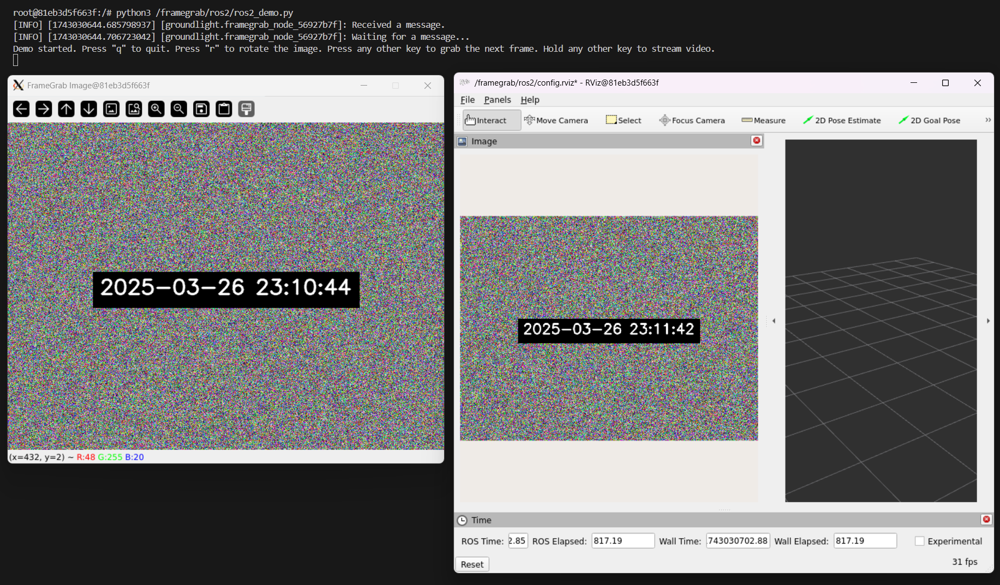

# FrameGrab on ROS2

This directory contains utilities for developing and testing FrameGrab on ROS2 Humble. There is a docker container that runs a mock camera stream (`sample_camera.py`) as well as a test script that creates a `ROS2FrameGrabber` and lets you collect frames (`ros2_demo.py`).

## Run the Demo
1. This demo creates GUI elements in the container (RViz2 and OpenCV). In order to see them, you need to install and run [XLaunch](https://sourceforge.net/projects/vcxsrv/).
1. Bring up the docker container. From this directory, run `docker compose up -d`. This will build the container, mount the `framegrab` diretory into the container, and pip install `framegrab` in editable mode. This can be helpful for interactive development.
1. In one terminal window, start the camera publishing node: `docker exec -it framegrab_ros_container /framegrab/ros2/start_camera.sh`
1. In another terminal window, launch the demo: `docker exec -it framegrab_ros_container /framegrab/ros2/demo.sh`.

